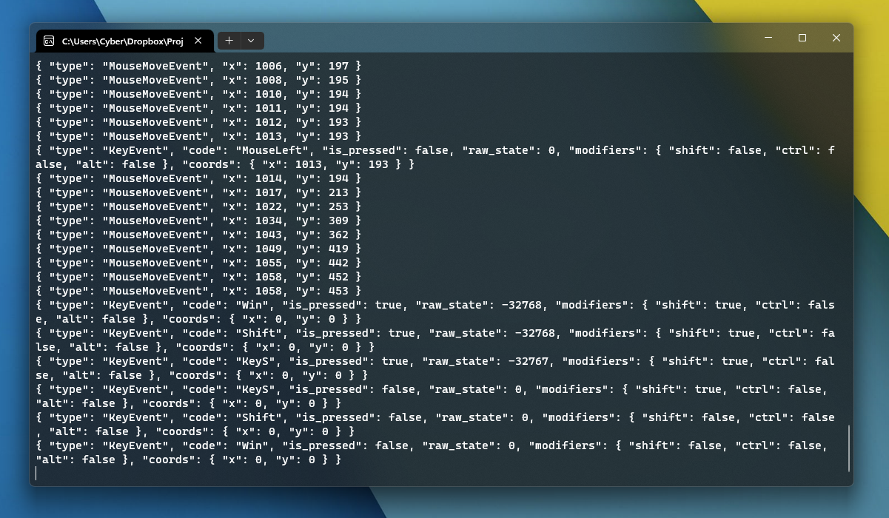

# keylogger
A simple C++ program for Windows that outputs JSON data to stdout for key presses, mouse clicks, and mouse movement.

Download [keylogger.exe](./keylogger.exe).

The idea is that this program can be run as a subprocess from another script and its output can be parsed and used in other code, similar to a proper API.

## Outputs
All output from the program is in JSON format, and each object has a `type` property that indicates the structure of the object.

Note that polling is capped at 60Hz.

### Type `InitEvent`
Fired once on startup.

* string[] `key_codes`: An array of all registered key codes.
* number `key_count`: The number of registered keys.

### Type `KeyEvent`
Fired when the affected key changes state (pressed or released).

* string `code`: The code for the affected key.
* boolean `is_pressed`: `true` if the key is pressed, `false` otherwise.
* number `raw_state`: The internal value representing the key's current state.
* object `modifiers`: Contains properties for the state of modifier keys.
    * boolean `shift`: `true` if Shift is down, `false` otherwise.
    * boolean `ctrl`: `true` if Control is down, `false` otherwise.
    * boolean `alt`: `true` if Alt is down, `false` otherwise.
* object `coords`: Contains properties for the current mouse coordinates. These are set to `0` unless the key is `MouseLeft`, `MouseRight`, or `MouseMiddle`.
    * number `x`: The current X coordinate.
    * number `y`: The current Y coordinate.

### Type `MouseMoveEvent`
Fired when the cursor's coordinates change.

* number `x`: The current X coordinate.
* number `y`: The current Y coordinate.

## Key codes
`KeyA`, `KeyB`, `KeyC`, `KeyD`, `KeyE`, `KeyF`, `KeyG`, `KeyH`, `KeyI`, `KeyJ`, `KeyK`, `KeyL`, `KeyM`, `KeyN`, `KeyO`, `KeyP`, `KeyQ`, `KeyR`, `KeyS`, `KeyT`, `KeyU`, `KeyV`, `KeyW`, `KeyX`, `KeyY`, `KeyZ`, `Key0`, `Key1`, `Key2`, `Key3`, `Key4`, `Key5`, `Key6`, `Key7`, `Key8`, `Key9`, `Semicolon`, `Equal`, `Comma`, `Minus`, `Period`, `Slash`, `Backtick`, `BracketLeft`, `Backslash`, `BracketRight`, `Quote`, `KeyF1`, `KeyF2`, `KeyF3`, `KeyF4`, `KeyF5`, `KeyF6`, `KeyF7`, `KeyF8`, `KeyF9`, `KeyF10`, `KeyF11`, `KeyF12`, `Escape`, `Tab`, `CapsLock`, `Space`, `Enter`, `Backspace`, `Insert`, `Delete`, `Home`, `End`, `PageUp`, `PageDown`, `ArrowLeft`, `ArrowRight`, `ArrowUp`, `ArrowDown`, `PrintScreen`, `ScrollLock`, `Pause`, `NumLock`, `ContextMenu`, `Win`, `Win`, `Numpad0`, `Numpad1`, `Numpad2`, `Numpad3`, `Numpad4`, `Numpad5`, `Numpad6`, `Numpad7`, `Numpad8`, `Numpad9`, `NumpadMultiply`, `NumpadAdd`, `NumpadSubtract`, `NumpadDecimal`, `NumpadDivide`, `VolumeMute`, `VolumeDown`, `VolumeUp`, `MediaNext`, `MediaPrevious`, `MediaStop`, `MediaPlayPause`, `Shift`, `Control`, `Alt`, `MouseLeft`, `MouseRight`, `MouseMiddle`, `MouseForward`, `MouseBack`